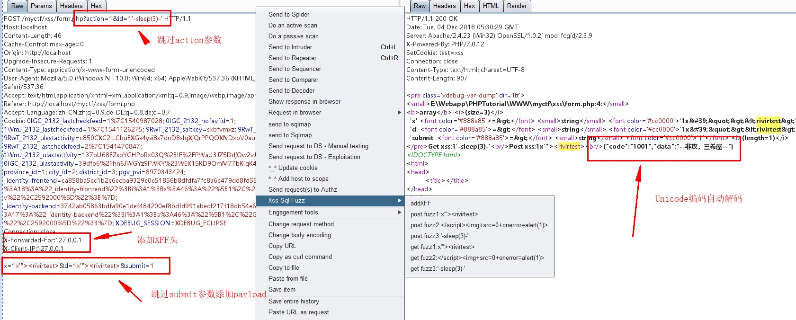

## Xss-Sql-Fuzz

一个burpsuite 插件 用来fuzz xss和sql注入, 可以对post,get 的所有参数一键自动添加上我们的payload.

## Usage
Extender->Option 添加jython包
Extender->Extensions->Add 添加Xss-Sql-Fuzz.py 插件。

## ToDO
- [x] 对GET型参数添加payload
- [x] 对POST型参数添加payload
- [x] 对响应中的unicode 解码
- [x] 添加XFF头
- [x] 对GET POST型中的一些特殊参数比如token,submit, code,sign，action这些参数，会自动进行模糊匹配跳过。

如果想自定义payload, 直接再代码里面改即可。

	menuItem = ['addXFF','post fuzz1:x\'"><rivirtest>','post fuzz2:</script>','post fuzz3:\'-sleep(3)-\'','get fuzz1:x\'"><rivirtest>',
        'get fuzz2:</script>','get fuzz3:\'-sleep(3)-\'']

payload 如上，直接改冒号右边的payload即可生效，也可以自己添加菜单栏，添加格式: `get fuzz4:payload4`, `post fuzz4:payload4`

